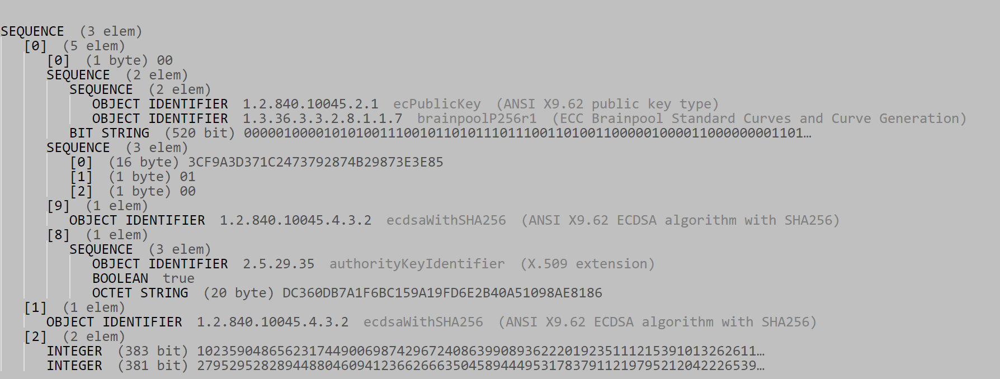

# ETSI SSP TTF x509 certificates generation
## Overview
This set of programs and files aims at generating the x509v3 certificates used for the Accessor Authentication Service as described in the annex C of the [TS 103.666 part 1 V15.2.0  (2020-04)](https://www.etsi.org/deliver/etsi_ts/103600_103699/10366601/15.00.00_60/ts_10366601v150000p.pdf) .
## Installation
OpenSSL 3.0.0 shall be installed and the guidlines for this installation are availabe in [OpenSSL](https://www.openssl.org).

Python Cryptography package shall be installed. The guidlines for this installation are availabe in [Cryptography.io](https://cryptography.io/en/latest/installation.html) .

## Generation of the private and public keys
The batch file GENKEY.bat contains the OpenSSL instruction for generating the private and public keys acccording to the the annex C of the TS 103.666 part 1.
The following shell command has been executed for the generation of the private keys available in this repository.

`./GENKEY.bat`

## Generation of the cerficates
The followint command shall be executed.

`python3 CreateCertificate.py -i <parameters_file.yaml`

The **parameters_file.yaml** contains the certificate parameters.
The certificates are generated and stored in the **./certificates** directory with the DER and PEM format.
The human readable visualization is possible on the following web site [Certlogic](https://certlogik.com/decoder)
## Certificate parameters
Each certificate has its parameters according to YAML structure in a YAML file.
As example, the YAML structure of the ETSI-SSP-AAA-CA certificate in the AAA certification path is the following:

    - Extensions:
        CertificatePolicies:
            Critical: true
            Value:
                Identifier: 0.4.0.3666.1.2
                Explicit_text: id-role-AAA
        BasicConstraints:
            Critical: true
            Value:
                CA: true
                Pathlen: 0
    Serial_number: 3
    Not_after: '2021-12-01T12:00:00'
    Not_before: '2021-01-01T12:00:00'
    Issuer:
            C: FR
            ST: PACA
            CN: ETSI-SSP-AAA-CI
            O: ETSI.ORG
            OU: SSP-TTF
    Subject:
            C: FR
            ST: PACA
            CN: ETSI-SSP-AAA-CA
            O: ETSI.ORG
            OU: SSP-TTF
The YAML files available in the repository contain the desription for all required certificates for a given certification path.
## Generation of the authentication token
The following command allows to generate an authentication token:
`python3 CreateToken.py -i <parameters_file.yaml`

The **parameters_file.yaml** contains the authentication token parameters.

    Challenge:
    Generate: false # Do not generate a challenge
    Name: AAS01     # File name of the file containing the challenge
    CertificationPath: 
    Name: CP_AAA    # File name of the DER file containing the certification path (set of certificates)
    Path:
        - ETSI-SSP-AAA-CI # AAA CI
        - ETSI-SSP-AAA-CA # AAA CA
        - ETSI-SSP-AAA-EE # AAA EE
    Modeles:
        - RFC5280.asn     # x509v3 certificate model
        - RFC3279.asn     # ECC signature parameters
    AuthenticationToken:  
    Name: ATK-AAA-ECKA    # File name of the authentication token DER file
    Issuer: ETSI-SSP-AAA-EE # Certificatte verifying the authentication token
    ECKA-Curve: BrainpoolP256R1 # ECC curve for key agreement
    KeySize: 256  # key size of the streamcipher
    Modeles: 
        - RFC5280.asn     # x509v3 certificate model
        - RFC3279.asn     # ECC signature parameters
        - SSP_ASN.asn     # SSP model

The authentication token can be dumped by using the online tool [here](https://lapo.it/asn1js/#).

## Generation of the accessor authentication commands and responses.
The following command allows to generate the commands for the accessor authentication service:
`python3 CreateAuthCommand.py -i <parameters_file.yaml`

    Challenge command: # Generate a challenge
        Name: AAS01      # Write a binary file containing a 128 bit challenge
    Challenge response:
        Path: CP_AAS     # AAS certification path
        Challenge: AAS01 # Write a binary file containing a 128 bit challenge
        Name: aAAS-OP-GET-CHALLENGE-Service-Response
    Read Challenge response:
        Name: aAAS-OP-GET-CHALLENGE-Service-Response
    Authenticate command:
        Path: CP_AAA # File name of the DER file containing the certification path
        AuthenticationToken: ATK-AAA-ECKA # File name of the DER file containing the authentication token
        Name: aAAS-OP-AUTHENTICATE-Service-Command
    Authenticate response:
        AuthenticationToken: ATK-AAS-ECKA
        Name: aAAS-OP-AUTHENTICATE-Service-Response 
    OAS command: # Generate aAAS-OP-ACCESS-SERVICE-Service-Command for secure pipe
        Name: OAS_COMMAND # Name file containing the DER command
        Service Identifier: 'DD61116FF0DD57F48A4F52EE70276F24' # Root accessor identifier
    OAS response: # Generate aAAS-OP-ACCESS-SERVICE-Service-Response with a random gate identifier
        Name: OAS_RESPONSE # Name file containing the DER response
    Read OAS response: # Read aAAS-OP-ACCESS-SERVICE-Service-Response and extract the gate identifier
        Name: OAS_RESPONSE  # Name file containing the DER response 
    Generate shared key:
        Private: ATK-AAA-ECKA # File name of the DER file containing the private key
        Public: ATK-AAS-ECKA # File name of the DER file containing the authentication token
        Name: GCM_AAA_AAS # File name of the DER file containing K and IV
    Encrypt:
        Name: GCM_AAA_AAS # Container for the derived keys/IV
        MTU: 240 # MTU of the secure SCL message
        Sequence: 1
        In: Text_In # File name in
        Out: Text_Out #File Name out
    Decrypt:
        Name: GCM_AAA_AAS
        MTU: 240
        In: Text_Out # File name in
        Out: Text_Out_bis #File Name out